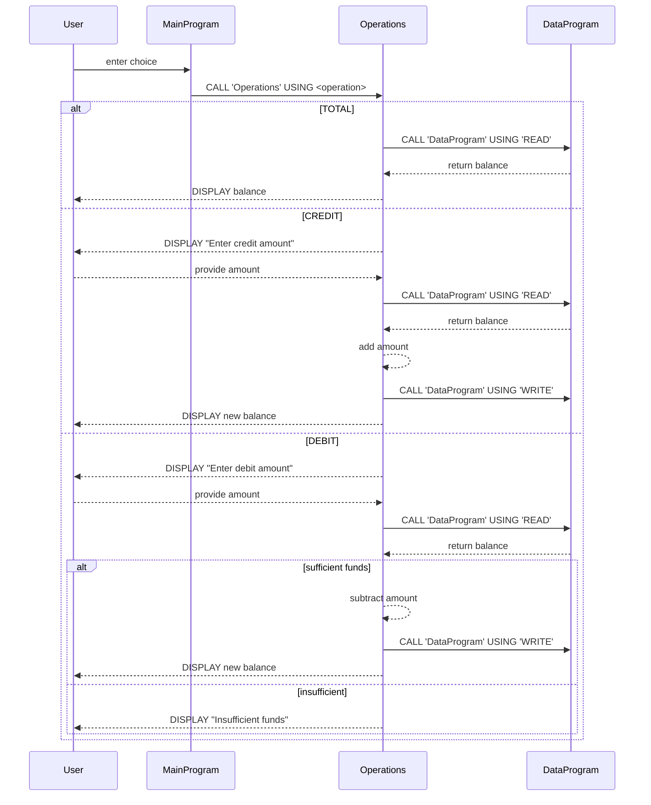

# COBOL Student Account System Documentation

This directory contains a legacy COBOL application for managing student account balances. The system is organized into three source files under `src/cobol`:

- `data.cob`
- `operations.cob`
- `main.cob`

Each file has a specific role in the application architecture and implements business logic related to student accounts.

---

## File Overview

### `data.cob` (DataProgram)

This program acts as the simple data store for account balances. It uses working-storage variables to keep a single balance in memory and provides a linkage interface for reading or writing that value.

**Key elements:**
- `STORAGE-BALANCE` – working-storage field initialized to `1000.00` representing the starting student account balance.
- `OPERATION-TYPE` – determines whether the caller wants to "READ" or "WRITE" the balance.
- `PROCEDURE DIVISION USING PASSED-OPERATION BALANCE` – the public entry point.

**Behavior:**
- When called with `'READ'`, the current `STORAGE-BALANCE` is moved into the supplied `BALANCE` parameter.
- When called with `'WRITE'`, the supplied `BALANCE` parameter overwrites `STORAGE-BALANCE`.

This module encapsulates the storage rule: there is a single shared balance in memory, and all updates must go through this interface.

### `operations.cob` (Operations)

This program handles business operations on the account. It interprets a six-character operation type and either displays the total balance or performs credit/debit adjustments.

**Key elements:**
- `OPERATION-TYPE` and `AMOUNT` variables for tracking requests and input amounts.
- `FINAL-BALANCE` holds the retrieved or computed balance, seeded with `1000.00` as a default.
- The `PROCEDURE DIVISION` uses the passed operation to:
  - **TOTAL**: invoke `DataProgram` with `'READ'` and display the current balance.
  - **CREDIT**: prompt user for an amount, read the balance, add the amount, write back the new balance, and display confirmation.
  - **DEBIT**: prompt user for an amount, read the balance, check sufficient funds, subtract if possible, update storage, and display results or an insufficient funds message.

**Business rules:**
- A debit transaction cannot reduce the balance below zero; the program checks `FINAL-BALANCE >= AMOUNT` before allowing subtraction and reports "Insufficient funds" otherwise.
- All balance adjustments route through `DataProgram`, ensuring consistent persistence logic.

### `main.cob` (MainProgram)

This is the entry point with user interaction and menu logic. It displays a simple text menu and accepts choices.

**Key features:**
- A loop controlled by `CONTINUE-FLAG` that keeps the application running until the user selects the exit option.
- Presents options to view balance, credit account, debit account, or exit.
- Uses COBOL's `EVALUATE` statement to dispatch to `Operations` using a matching operation string (`'TOTAL '`, `'CREDIT'`, `'DEBIT '`).
- Validates input and shows an error message for invalid choices.

When the user selects option 4, the program sets the flag to `'NO'` and terminates with a farewell message.

---

## Business Rules Summary

- **Starting balance**: Every run begins with a $1,000.00 balance stored in `DataProgram`.
- **Read/Write encapsulation**: All interactions with the account balance must go through `DataProgram` using `'READ'` or `'WRITE'` operations.
- **Credit accounts**: Users can increase the balance by entering a positive amount.
- **Debit restrictions**: Users cannot debit more than the current balance; the system enforces non-negative balances and notifies on insufficient funds.
- **Input validation**: Menu choices outside 1–4 are rejected with an error prompt.

---

## Notes for Modernization

- The architecture separates concerns (storage, business logic, UI), which aids in translating each layer into modern languages.
- Data persistence is currently volatile; any future enhancements should replace `DataProgram` with a database or file-based storage.
- Business rules are simple and could be externalized to configuration or service methods during refactoring.

This README provides a high-level guide for developers working on modernizing or understanding the legacy COBOL system.

---

## Sequence Diagram

Below is a sequence diagram illustrating data flow through the application (rendered with Mermaid):

